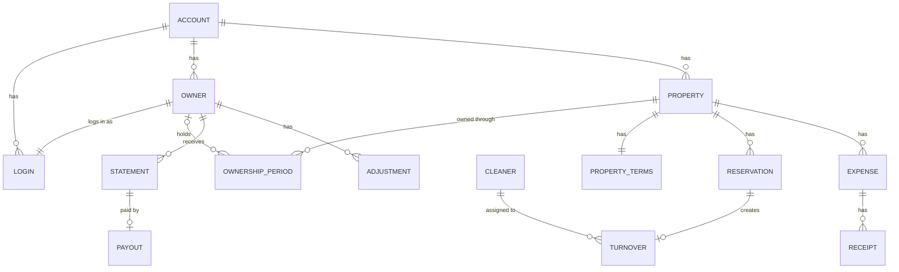

# 03 — Domain Model

Entities, relationships and identifiers. Money rules are in `06`; lifecycles in `04`, `05` and `06`.

## 1. Identifiers

- Every table MUST use a UUID primary key, except the framework's own infrastructure tables (migrations, queue, cache, sessions, password reset tokens), and no URL MAY expose a sequential or guessable identifier. [input, Q-098]
- UUIDs MUST be version 7, generated by the application. [Q-056, D-009]
- Every amount MUST be stored as integer cents and every percentage as integer basis points. [input, Q-057]

## 2. Entities

| Entity | Scope | Key fields |
| --- | --- | --- |
| Account | installation | name, logo, contact number, VAT rate on fees, status (pending, active, suspended) |
| Login | account | email, password, role (admin, operations) or owner, language, second factor |
| Owner | account | name, phone, email, IBAN, language, archived |
| Property | account | address, timezone, coordinates, AMA registry number, property type, capacity, check-in/out times, house info, Wi-Fi, house rules, check-in instructions, contact number, default turnover cost, archived |
| Ownership period | account | property, owner or none, from date |
| Property terms | account | management fee model and value, who keeps the guest-paid cleaning fee, who pays turnover cost |
| Reservation | account | property, channel, check-in, check-out, status, guest full name, phone, email, guest count, language, money lines |
| Turnover | account | reservation, property, date, cleaner, status, cost |
| Cleaner | account | name, phone, language, link token hash, archived |
| Expense | account | property, date, category, description, amount, charged to owner or absorbed |
| Receipt | account | expense, file |
| Statement | account | owner, month, status, snapshot of lines and totals |
| Adjustment | account | owner, month it lands in, amount, reason, link to its cause |
| Payout | account | statement, paid date |
| Climate fee rate | installation | property type, season, amount per night, valid from |
| Audit entry | account | who, when, entity, action, before, after |
| Terms acceptance | installation | account, login, terms version, time |

- A login MUST belong to exactly one account, and an email address MUST be unique across the installation. [Q-001]
- An owner MUST have exactly one login. [Q-002]
- Text shown to guests or cleaners (house info, check-in instructions, house rules, turnover notes) MUST have a Greek and an English version. [Q-042]
- A property MUST store coordinates for the guest-page map. [Q-037]
- A property MUST carry a property type used to look up the climate resilience fee rate. [Q-033]
- A property MUST carry a timezone, chosen by staff when the property is set up, defaulting to Europe/Athens. [Q-082, Q-092]
- A reservation MUST store the guest's full name, guest count, phone and email, and nothing else about the guest. [Q-008]
- A property MUST have a default turnover cost. [Q-058, D-014]

## 3. Ownership

- A property MUST have at most one owner on any date. [Q-003]
- Ownership MUST be recorded as dated periods so that changing the owner from a date keeps earlier periods unchanged. [Q-004]
- A period with no owner MUST mean the property belongs to the account itself. [Q-059, D-027]

## 4. Archiving and deletion

- Owners, properties and cleaners MUST be archived rather than deleted once anything references them; archiving revokes their login or link and hides them from daily lists, and keeps their history and finalised statements unchanged. [Q-010]
- A record MAY be hard-deleted only when nothing references it. [Q-010]

## 5. Reservation status

- A reservation MUST have a status of confirmed or cancelled; cancelled reservations stay as records (`04` §3). [Q-005]

## 6. Derived records

- An adjustment created by an edit after finalisation MUST reference the record whose change caused it (`06` §8). [Q-006]
- A finalised statement MUST store a snapshot of its lines and totals so that later edits never change it. [input, Q-006]
- Every create, update and delete of reservations, money lines, expenses, property terms, adjustments, statements and payouts MUST write an audit entry with the user, time and before/after values. [Q-007]

## 7. Relationships

