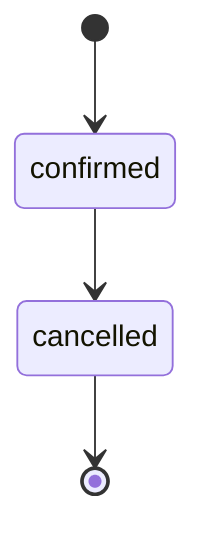

# 04 — Reservations and Calendar

How reservations are entered, change state and appear on the calendar. What they are worth is `06`.

## 1. Channels

- A reservation MUST have one channel: Airbnb, Booking.com, direct, or owner stay. [input]
- Reservations MUST be entered by hand in the product; nothing is imported (`01` §7). [input, Q-025]

## 2. Fields

- A reservation MUST record its property, channel, check-in and check-out dates, guest count, guest full name, phone and email, and the language of its guest page. [input, Q-008]
- Admins and operations staff MUST be able to create and edit reservations; only admins MUST be able to see or enter money lines (`07` §2). [input]
- A reservation entered by operations MUST be saved without money lines for an admin to complete. [Q-087]

## 3. Lifecycle

- A reservation MUST be created confirmed and MAY be cancelled; a cancelled reservation MUST NOT return to confirmed. [Q-005]
- Cancelling MUST free the dates, delete a pending turnover, and keep any money lines entered (a paid cancellation), which count in the month of the original check-out (`06` §4). [Q-005, D-020]
- Changing a reservation's dates or property MUST move its pending turnover; a done turnover is never moved automatically. [Q-060, D-020]
- Editing a reservation that counted in a finalised statement MUST be allowed and MUST produce an adjustment (`06` §8). [Q-006]

## 4. Overlap

- Two confirmed reservations on the same property MUST NOT overlap. [input, Q-005]
- A stay MUST occupy [check-in, check-out) so that a check-out and a check-in on the same day do not overlap, and the rule MUST be enforced by a database exclusion constraint as well as by validation. [Q-061, D-010]
- Cancelled reservations MUST be ignored by the overlap check. [Q-005]

## 5. Money lines

Admins enter, per reservation: [input, Q-028, Q-053]

| Line | Meaning |
| --- | --- |
| Gross | what the guest paid for the stay, excluding the guest-paid cleaning fee |
| Channel commission on the stay | host-side fee of the channel on the gross |
| Guest-paid cleaning fee | what the guest paid for cleaning |
| Channel commission on cleaning | host-side fee of the channel on the cleaning fee, when the channel reports it |
| Climate resilience fee | passed to the state |
| Other taxes | other levies passed through |

- The guest-paid cleaning fee MUST be a line of its own, outside gross. [Q-028]
- The channel commission MUST be split between the stay and the cleaning fee when the channel reports the split; otherwise all of it is entered on the stay. [Q-053]
- The climate resilience fee MUST be prefilled as the sum, over the stay's nights, of the installation rate for the property's type valid on each night's date (`06` §5), and MAY be edited per reservation. [Q-033]
- An owner stay MUST carry no money lines and no management fee. [Q-034]

## 6. Calendar and timeline

- Each property MUST have a calendar of its reservations and owner stays. [input]
- Staff MUST have a timeline showing all properties' reservations side by side (`09` §1). [input]
- The calendar MUST show reservations and owner stays only; there are no blocked dates. [Q-026]
- Calendars MUST be views of the product's own records only; nothing is sent to a channel. [input]
