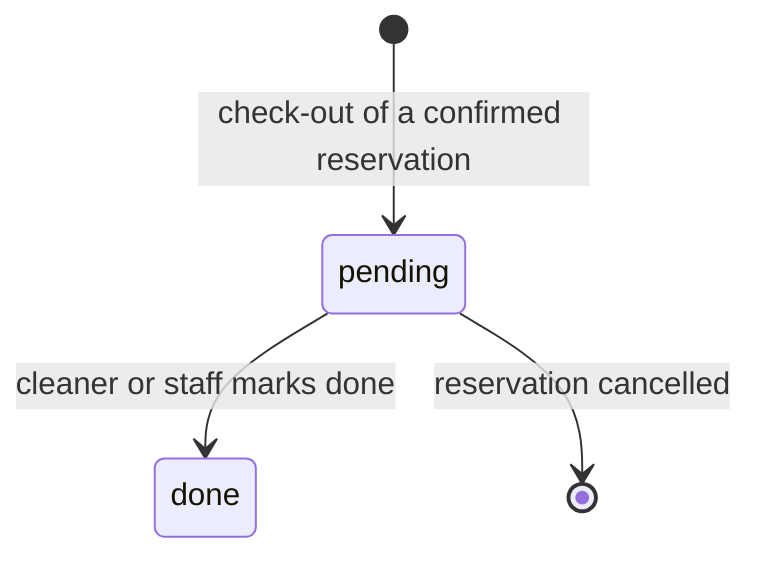

# 05 — Turnovers and Cleaners

The cleaning schedule that follows check-outs, and the people who do it.

## 1. Turnovers

- Every confirmed reservation, owner stays included, MUST create one turnover dated on its check-out date. [input, Q-005, Q-034]
- A turnover MUST have a status of pending or done. [input]
- A turnover MUST be assignable to one cleaner; it MAY be created unassigned and reassigned while pending. [input, Q-088]
- The assigned cleaner MUST be able to mark it done through their link (`08` §3), and staff MAY also mark it done. [input, Q-069]
- A turnover MUST follow its reservation's date and property while pending, and MUST be deleted when its reservation is cancelled while pending; a done turnover MUST NOT change automatically. [Q-060, D-020]
- A turnover MAY carry notes for the cleaner in Greek and English. [input, Q-042]

## 2. Cost

- A turnover MUST have a cost, prefilled from the property's default turnover cost and editable per turnover. [input, Q-058]
- The cost MUST be charged to the owner or absorbed by the account according to the property's terms (`06` §2). [input]
- An owner-paid turnover cost MUST be deducted on the line of the reservation whose check-out created it (`06` §3). [Q-081, D-015]
- Operations staff MUST NOT see turnover costs. [input]

## 3. Cleaners

- A cleaner MUST have a name, a phone number and a language, and no login. [input, Q-055]
- Each cleaner MUST have one signed link that staff can revoke or reissue (`10` §2). [input, Q-072]
- Archiving a cleaner MUST revoke the link and keep their past turnovers. [Q-010]

## 4. Cleaner pay summary

- Admins MUST be able to see, per cleaner per month, the done turnovers dated in that month with their costs and the total. [Q-023]
- The summary MUST NOT record payments to cleaners. [Q-023]
