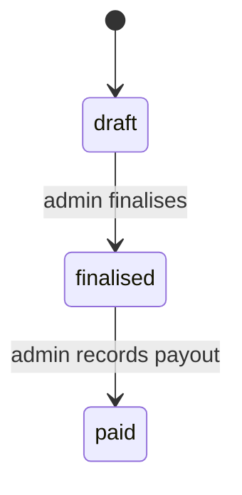

# 06 — Money and Statements

The calculation that decides every payout, and the statement that carries it. All arithmetic lives in `app/Money` (`02` §1).

## 1. Units and rounding

- Every amount MUST be integer euro cents and every percentage integer basis points; no float or decimal type appears on a money path. [input, Q-057]
- Every computed amount MUST be rounded half up to the cent on its own line, and every total MUST equal the sum of its rounded lines. [Q-032]

## 2. Property terms

- Each property not owned by the account MUST have one management fee model: % of net (the default), % of gross, fixed per reservation, or fixed monthly. [input]
- Each property MUST say who keeps the guest-paid cleaning fee (account or owner) and who pays turnover costs (account or owner). [input]
- Each account MUST have a VAT rate on management fees, 0 allowed. [Q-031]

## 3. Owner share per reservation

For a reservation that counts in a month: [input, Q-028, Q-030, Q-031, Q-053]

```
gross
− channel commission on the stay
− climate resilience fee
− other taxes
= net rental income
− management fee            (§3 models)
− VAT on the management fee
− turnover cost             (if owner-paid)
+ guest-paid cleaning fee − channel commission on cleaning   (if the owner keeps it)
= owner share
```

- Other taxes MUST be deducted before net rental income, like the climate resilience fee. [Q-030]
- The guest-paid cleaning fee MUST go whole to whoever keeps it, and no management fee MUST apply to it. [Q-028]
- The channel commission on cleaning MUST follow the cleaning fee to whoever keeps it. [Q-053]
- % of net MUST be computed on net rental income. [input]
- % of gross MUST be computed on gross minus the climate resilience fee and other taxes. [Q-029]
- Fixed per reservation MUST apply to every confirmed reservation that is not an owner stay, and to a cancelled reservation only when it keeps gross above zero. [Q-034, Q-054]
- VAT MUST be computed on each management fee line at the account's rate and shown as its own line. [Q-031]

## 4. Which month

- A reservation MUST count, whole, in the month of its check-out date in the property's timezone; a cancelled one with money in the month of its original check-out. [input, Q-082, Q-005]
- Every other date tied to a property MUST be read in the property's timezone, and dates not tied to a property in Europe/Athens. [Q-096, D-040]
- An expense MUST count in the month of its date. [Q-045]
- A fixed monthly fee MUST be charged per property per month, even with no reservations, dated the last day of the month. [input, Q-045]
- Every dated item MUST belong to the owner who held the property on its date (`03` §3). [Q-004, Q-045]

## 5. Climate resilience fee rates

- Rates MUST be one installation-wide table by property type and season, maintained by the operator (`11` §4), with dated validity so past reservations keep their rates. [Q-033, Q-062]

## 6. Expenses

- An expense MUST be either charged to the owner or absorbed by the account, and MAY carry receipt files the owner sees on the finalised statement. [Q-080, Q-022]

## 7. Payout and negative months

- Payout MUST equal the sum of owner shares, minus owner-charged expenses, minus fixed monthly fees with their VAT, plus or minus adjustments landing in the month. [input, Q-031, Q-045]
- When that sum is negative, the payout MUST be zero and the negative amount MUST become an adjustment on the owner's next month. [Q-027]

## 8. Adjustments

- When a record that counted in a finalised statement changes, the system MUST compute the change in that owner's amount and post it as an adjustment on the owner's earliest month without a finalised statement, linked to the change. [Q-006]
- A finalised statement's numbers MUST NOT change. [input]

## 9. Statement lifecycle



- There MUST be one statement per owner per month covering all their properties, drafted, reviewed, finalised and marked paid by an admin. [input]
- A draft MUST be computed from current records whenever it is opened; only finalisation stores lines. [Q-063, D-031]
- A draft MUST NOT be finalised while a counting reservation has no money lines. [Q-083, D-028]
- Finalising MUST freeze a snapshot of every line and total, produce the PDF and email the owner a link (`09` §7). [input, Q-021, D-007]
- A finalised statement MUST NOT return to draft. [Q-093]
- Recording the payout MUST store the date paid; the product MUST NOT move money. [input, Q-091]
- For self-owned properties the account MUST get a monthly view of income, deductions, expenses and net, with no management fee and no statement. [input]
