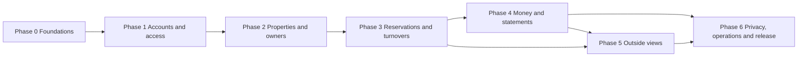

# Implementation Plan for GenAI SWE Agents

## 1. Delivery strategy

Implement in thin, testable vertical increments. GenAI agents work best with bounded tasks, explicit inputs, a small file surface and executable acceptance criteria. Avoid parallel edits to shared foundations such as migrations, contract root files and global authorization middleware.

Each phase ends with a running integrated system. Work packages are relative units of work, not calendar promises. Every package has a row in `TRACEABILITY.md`; a package is `done` only when its acceptance ran and passed.

## 2. Dependency overview

## 3. Phase 0 — Foundations

Goal: a reproducible repository, one command that runs every gate, CI that runs only those commands, and the shared contracts, before any domain work.

### Work packages

`FND-01` Command contract and repository scaffold

- Make every target of the root `Makefile` real, replacing the failing placeholder bodies the documentation pack ships with: `setup`, `infra-up`, `infra-status`, `infra-down`, `migrate`, `dev`, `test`, `test-browser`, `lint`, `format`, `format-check`, `typecheck`, `build`, `verify`, `smoke`, `audit`, `scan-secrets`, `clean-start`. `check-docs` is already real and stays green.
- Create the Laravel 13 application with Fortify, Inertia, Vue 3 in TypeScript, Tailwind 4 and PrimeVue 4 in the layout of `02` §1, with the stack of `02` §2.
- Local Compose (or equivalent) for PostgreSQL 16; environment examples; lockfiles committed.
- `make verify` runs every gate the testing specification requires that exists at this point; `make clean-start` proves a fresh clone boots, verifies and tears down.
- Surfaces: —
- Touches red line: yes
- Contract change: yes

`FND-02` CI baseline

- A pipeline on the project's remote, running on every merge request and every push to the default branch, against PostgreSQL 16 as a service, never a lighter substitute (`12` §1).
- Every job runs exactly one `Makefile` target, so "CI is green" and "`make verify` is green" are the same statement; `README.md` maps job to command.
- `make check-docs` runs as its own job.
- Every gate the testing specification requires but nothing implements yet is a failing-forward tripwire: a job that passes only while the gate is provably absent and fails with promotion instructions the moment it becomes runnable. A missing gate and a silently passing gate must never look alike.
- Dependency and secret scanning; artifact and cache strategy; no job retries.
- Surfaces: ux
- Touches red line: yes
- Contract change: no

`FND-03` Design, accessibility and localization foundation

- Shared tokens and base components, focus and error patterns, responsive shell for the four entry surfaces of `02` §4, branded per `09` §5.
- Localization skeleton with the fallback rule of `09` §6; no hard-coded UI strings.
- Automated accessibility smoke test wired as a real gate, replacing its tripwire (`09` §9, `12` §1).
- Surfaces: security, ux
- Touches red line: yes
- Contract change: no

### Exit criteria

A fresh clone boots locally through `make clean-start`; CI is green on the remote and a red pipeline blocks a merge; `make check-docs` passes; every tripwire is either promoted or still provably absent.

## 4. Phase 1 — Accounts and access

Goal: an account can exist, its people can log in with the right role, and nothing crosses the tenant boundary.

### Work packages

`ACC-01` Tenancy and isolation harness

- `company_id` and the global scope of `02` §3 on a first tenant model; the isolation suite of `12` §3 as a reusable harness every later package extends.
- Surfaces: external
- Touches red line: yes
- Contract change: yes

`ACC-02` Sign-up, approval and terms

- Public sign-up with email verification, a pending state until the operator command approves it, and recorded terms acceptance (`01` §4, `10` §8, `11` §4).
- Surfaces: security, scope, external
- Touches red line: yes
- Contract change: yes

`ACC-03` Logins, invitations, roles and second factor

- Invitations, the admin and operations roles, the permission matrix as policies, the owner login type, and the second factor (`07` §1–§4, `10` §9).
- Surfaces: data, security
- Touches red line: yes
- Contract change: yes

`ACC-04` Audit trail

- The audit entry of `03` §6 and its admin view (`10` §4), ready for every later money-affecting model.
- Surfaces: data
- Touches red line: no
- Contract change: yes

### Exit criteria

A browser test signs up, is approved by command, logs in as admin and invites an operations user and an owner; the isolation suite passes for every model and route that exists.

## 5. Phase 2 — Properties and owners

Goal: an account holds its owners, properties, terms and cleaners.

### Work packages

`PRP-01` Owners and properties

- Owners, properties with bilingual guest text and coordinates, ownership periods and self-owned properties (`03` §2–§3), and archiving (`03` §4).
- Surfaces: data, external, ux
- Touches red line: no
- Contract change: yes

`PRP-02` Property terms

- Fee model, cleaning-fee keeper, turnover-cost payer and the account VAT rate (`06` §2), admin only (`07` §2).
- Surfaces: security, external
- Touches red line: yes
- Contract change: yes

`PRP-03` Cleaners and their links

- Cleaners, link issue, revoke and reissue (`05` §3, `10` §2).
- Surfaces: data, security
- Touches red line: yes
- Contract change: yes

### Exit criteria

The onboarding journey of `09` §3 runs end to end; operations sees no IBAN, terms or amount; isolation tests cover every new model and route.

## 6. Phase 3 — Reservations and turnovers

Goal: a month of reservations can be entered and its turnovers run.

### Work packages

`RES-01` Reservations and overlap

- Reservation entry, channels, lifecycle and cancellation, and the overlap constraint (`04` §1–§4).
- Surfaces: data, scope
- Touches red line: no
- Contract change: yes

`RES-02` Money lines and climate fee rates

- Money lines, the installation rate table and its operator command, and climate fee prefill (`04` §5, `06` §5).
- Surfaces: external
- Touches red line: no
- Contract change: yes

`RES-03` Calendar and timeline

- Per-property calendar and the multi-property timeline as the staff home (`04` §6, `09` §1).
- Surfaces: scope, ux
- Touches red line: no
- Contract change: no

`RES-04` Turnovers

- Turnovers at check-out, assignment, completion by staff, cost and following the reservation (`05` §1–§2).
- Surfaces: ux
- Touches red line: no
- Contract change: yes

### Exit criteria

The "run a month" journey of `09` §3 runs end to end up to turnovers done; overlapping reservations are refused by the database; operations never sees a money line.

## 7. Phase 4 — Money and statements

Goal: each owner's month closes with a statement that matches a hand calculation to the cent.

### Work packages

`MON-01` Calculation engine

- The pure calculation of `06` §1–§4 and §7 in `app/Money`, with the golden tests of `12` §5.
- Surfaces: data, external
- Touches red line: yes
- Contract change: no

`MON-02` Expenses and receipts

- Expenses and receipt files (`06` §6), stored and served per `03` §2 and `10` §5.
- Surfaces: data, scope, external, ux
- Touches red line: yes
- Contract change: yes

`MON-03` Statement lifecycle

- Drafts, finalisation snapshot, payout recording, the self-owned monthly view (`06` §9).
- Surfaces: scope
- Touches red line: yes
- Contract change: yes

`MON-04` Adjustments and carry-forward

- Computed adjustments after finalisation and negative carry-forward (`06` §7–§8).
- Surfaces: data, external
- Touches red line: yes
- Contract change: yes

`MON-05` Statement PDF and email

- The PDF in both languages and the finalisation email (`06` §9, `09` §7).
- Surfaces: scope, external
- Touches red line: yes
- Contract change: no

`MON-06` Dashboard and cleaner pay summary

- The admin dashboard (`09` §2) and the cleaner pay summary (`05` §4).
- Surfaces: scope
- Touches red line: no
- Contract change: no

### Exit criteria

Every golden test of `12` §5 passes; the "close a month" journey of `09` §3 runs end to end; a finalised statement does not change when a counted reservation is edited, and the adjustment appears on the next month.

## 8. Phase 5 — Outside views

Goal: owners, guests and cleaners see exactly their narrow view.

### Work packages

`OUT-01` Owner portal

- The read-only portal of `08` §1 with statements, receipts and PDFs.
- Surfaces: data, security, scope, ux
- Touches red line: yes
- Contract change: no

`OUT-02` Guest page and map

- The guest page of `08` §2 with the self-hosted map (`02` §5, `11` §7).
- Surfaces: security, external, ux
- Touches red line: yes
- Contract change: no

`OUT-03` Cleaner link

- The cleaner page of `08` §3 with marking done.
- Surfaces: data, security, ux
- Touches red line: no
- Contract change: no

### Exit criteria

The outside journeys of `09` §4 run end to end; the leak tests of `12` §4 pass.

## 9. Phase 6 — Privacy, operations and release

Goal: the product can run in production for external accounts.

### Work packages

`OPS-01` Retention jobs

- Anonymisation and erasure of `10` §5 on the scheduler.
- Surfaces: data
- Touches red line: yes
- Contract change: no

`OPS-02` Account lifecycle and data requests

- Suspend, export, delete and person export or erasure commands (`10` §6–§7, `11` §4).
- Surfaces: data, security, external
- Touches red line: yes
- Contract change: no

`OPS-03` Production deployment and backups

- The production setup of `11` §2–§3, backups and a rehearsed restore (`11` §5).
- Surfaces: data, external
- Touches red line: yes
- Contract change: no

`OPS-04` Release acceptance

- Every journey of `12` §6 and the release gate of `12` §7.
- Surfaces: —
- Touches red line: no
- Contract change: no

### Exit criteria

The release gate of `12` §7 holds on the production host.

## 10. Safe parallelization

After a phase's shared model and contracts are merged, agents may work concurrently on low-overlap packages. Never parallelize migrations for the same aggregate, or concurrent edits to central policies or the contract root, without explicit ownership.

Suggested maximum lanes:

- Backend domain and migrations (one lane per aggregate, never two on the same tables).
- Staff app pages.
- Outside views (owner portal, guest page, cleaner link).
- Money engine and its golden tests (`app/Money` only).
- Tests and infrastructure.

Each lane uses a branch or worktree and integrates through small reviewed merges.

## 11. Backlog discipline

Each ticket MUST include spec references, dependency and allowed file surface, contract and schema impact, acceptance tests and explicit exclusions. [D-005]

If a ticket reveals a locked-decision conflict, stop and create an ADR; do not improvise a redesign.
